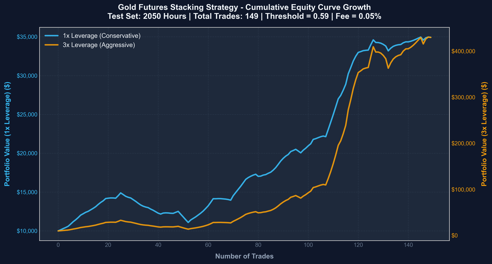

# ML Project - Прогнозирование краткосрочного направления движения цены фьючерса на золото

**Студент:** Мирумян Артём Ромуальдович

**Группа:** БИВ234

## Быстрые ссылки (CP3)
- [Финальный отчет (CP3)](report/report.md)
- [Журнал экспериментов](EXPERIMENTS.md)
- [Интерактивный UI Frontend](frontend/README.md)

---

## Описание задачи

**Задача:** Трехклассовая классификация направления движения цены фьючерса на золото (0: Down, 1: Flat, 2: Up). Горизонт: 24 часа.

**Основной фокус CP3:** Переход к ансамблевым методам (Stacking), калибровка вероятностей, внедрение бизнес-метрики Hit Rate (с фильтрацией сделок по порогу уверенности) и создание полноценного продукта с API и графическим интерфейсом.

**Использованные внешние факторы:**
- **DXY** (Индекс доллара)
- **VIX** (Индекс волатильности)
- **TNX** (Доходность 10-летних облигаций США)
- **Silver** (Серебро)
- **Oil** (Нефть марки WTI)

---

## Структура репозитория

```
.
├── app/
│   └── main.py                            # FastAPI Backend (ML Service)
├── frontend/                              # React + Vite Frontend (Interactive UI)
├── data/
│   ├── raw/                               # Исходные CSV-файлы
│   │   ├── gold_data_1h_cleaned.csv       # Часовые данные по золоту
│   │   └── external/                      # Внешние макро-данные
│   │       └── external_factors_combined.csv
├── models/
│   └── cp3_stacking_model.pkl             # Финальная модель (Stacking)
├── report/
│   └── report.md                          # Подробный отчет по всем 8 пунктам CP3
├── src/
│   ├── preprocessing.py                   # Пайплайн обработки (включая merge_asof)
│   └── modeling.py                        # Stacking Ensemble и Threshold Tuning
├── tests/
│   └── test.py                            # Тесты корректности
├── save_cp3_model.py                      # Скрипт обучения финальной модели
├── requirements.txt                       # Зависимости Python
└── README.md                              # Этот файл
```

---

## Запуск проекта (Деплой)

Для запуска связки Backend + Frontend выполните следующие шаги в разных окнах терминала.

**1. Запуск Backend (FastAPI)**
```bash
pip install -r requirements.txt
uvicorn app.main:app --reload
```
API будет доступно по адресу: http://127.0.0.1:8000

**2. Запуск Frontend (React)**
```bash
cd frontend
npm install
npm run dev
```
Интерфейс будет доступен по адресу: http://localhost:5173

---

## Финальные Результаты и Бизнес-Метрики (CP3)

В рамках CP3 мы перешли от оптимизации классических метрик (ROC-AUC) к максимизации бизнес-эффективности - **Hit Rate** и **теоретической доходности** с помощью калибровки вероятностей ансамбля Stacking.

### Сравнение моделей по точности сигналов
| Модель | Порог уверенности | ROC-AUC | Hit Rate (Test) | Кол-во сделок |
|---|---|---|---|---|
| LogReg CP2 (baseline) | 0.45 (фикс.) | 0.5742 | 59% | ~1800 |
| Stacking CP3 | 0.45 (фикс.) | 0.5732 | 57% | 1384 |
| **Stacking CP3** | **0.59 (оптимизирован)** | **0.5732** | **74%** | **149** |

---

### Результаты финансовой симуляции (Депозит $10,000, Комиссия 0.05%)

Мы провели вневыборочный симуляционный бэктест на **2050 торговых часах** (Hold-out Test Set) с учётом транзакционных комиссий и спреда:

| Показатель | Консервативная стратегия (1x плечо) | Агрессивная стратегия (3x плечо) |
|---|:---:|:---:|
| **Начальный капитал** | $10,000.00 | $10,000.00 |
| **Финальный баланс** | **$34,922.77** | **$429,667.46** |
| **Чистая прибыль** | **+$24,922.77 (+249.2%)** | **+$419,667.46 (+4196.7%)** |
| **Макс. просадка (Drawdown)** | **25.5%** | **58.4%** |
| **Профит-фактор (Profit Factor)** | **4.25** | **4.25** |
| **Коэффициент Шарпа (Sharpe)** | **4.20** | **4.20** |

* **Wins / Losses**: 110 сделок в плюс (73.8%) / 39 сделок в минус (26.2%).
* **Соотношение выигрыш/проигрыш**: **1.5 : 1** (Средний плюс: `+1.60%`, средний минус: `-1.06%`).

---

### Кривая доходности капитала (Equity Curve)
Кривая роста портфеля с $10,000 при консервативном и агрессивном подходах на тестовом периоде:



---

### Демонстрация интерактивного интерфейса (UI Frontend)
Интерактивный React UI (Vite + TypeScript) с отображением графика цен золота, вероятностей предсказания каждого класса и торговыми сигналами на основе оптимизированного порога:


---

## Качество кода и воспроизводимость
- **Fixed Seed (42):** Все эксперименты воспроизводимы.
- **No Leakage:** Слияние макро-данных выполнено строго через `merge_asof(direction='backward')`. Оптимизация порога (threshold) происходила строго на validation split, а тестировалась на hold-out test.
- **Интерактивность:** Полностью рабочий REST API и React Frontend для тестирования реальных прогнозов.
