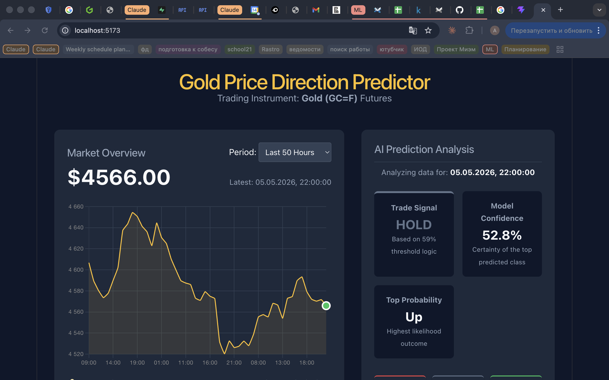

# Отчёт по проекту: Предсказание направления цены золота (CP3)

**Студент:** Мирумян Артём  
**Группа:** БИВ234  

---

## 1. Введение и постановка задачи

**Задача:** предсказать направление движения цены фьючерса на золото (GC=F) на горизонте 24 часа. Три класса: Up (рост > 0.2%), Down (падение > 0.2%), Flat (остальное).

**Почему именно эта метрика:**  
В трейдинге стандартная accuracy бесполезна — если модель угадывает 55% движений, но ошибается на крупных, реального профита нет. ROC-AUC честно показывает, насколько хорошо модель ранжирует вероятности — это общая мера качества. Но главная бизнес-метрика — **Hit Rate** (доля прибыльных сделок при фильтрации по порогу уверенности). Цель: Hit Rate ≥ 67% (2 к 1 по сделкам) при ≥ 100 сделках на тестовом периоде.

---

## 2. Поиск и описание данных

**Основные данные:** часовые OHLCV фьючерса GC=F с Yahoo Finance (`yfinance`), 2010–2024, ~60 000 строк.

**Внешние макро-факторы** (дневные, смержены через `merge_asof`):

| Тикер | Что это | Зачем |
|---|---|---|
| DX-Y.NYB | Индекс доллара (DXY) | Золото номинировано в USD |
| ^VIX | Индекс волатильности | Золото — защитный актив |
| ^TNX | Доходность 10-летних облигаций | Альтернативная доходность |
| SI=F | Серебро | Исторически коррелирует с золотом |
| CL=F | Нефть WTI | Индикатор инфляционных ожиданий |

Итого после мержа и feature engineering: **96 признаков**.

**Распределение классов в train:**

| Класс | Доля |
|---|---|
| 0 (Down) | 34.4% |
| 1 (Flat) | 17.0% |
| 2 (Up) | 48.6% |

---

## 3. Обработка и подготовка данных

**Очистка:** удалены дубликаты по времени, строки с Volume = 0, NaN в OHLC.

**Таргет:** `future_return = Close[t+24] / Close[t] - 1`. Если > 0.2% → Up (2), если < −0.2% → Down (0), иначе → Flat (1).

**Feature Engineering:**
1. **Технические:** лаги доходности (1h, 2h, 4h, 8h, 24h, 48h, 72h), RSI-14, RSI-6, MACD + signal + histogram, Bollinger Bands (12 и 24 периода), ATR-14, z-score цены и объёма.
2. **Макро:** для каждого внешнего фактора — ret1d, ret5d, ret20d, z-score за 20 дней, отклонение от MA20.
3. **Межрыночные:** `gold_silver_ratio`, `gold_minus_dxy_ret`, `gold_minus_silver_ret`, скользящие корреляции gold/dxy, gold/silver, gold/tnx на 24h и 120h окнах.
4. **Временные:** циклическое кодирование (hour_sin/cos, dow_sin/cos), бинарные флаги сессий (Азия, Европа, NY, overlap EU/NY).

**Важно про антилик:** макро-данные мержились строго через `pd.merge_asof(direction='backward')` — каждой часовой свече присваивался последний известный дневной Close, не будущий.

**Сплит:** хронологический (без перемешивания):
- Train: 65% | Val: 15% | Test: 20%
- Val использовался **только** для подбора порога confidence, Test — финальный holdout.

---

## 4. Baseline-модель

LogisticRegression на базовых признаках золота без макро, порог = 0.45 (fixed).

| Метрика | Значение |
|---|---|
| ROC-AUC | 0.5441 |
| Accuracy | ~0.50 |
| Hit Rate (thresh=0.45) | 54% |

54% — почти монетка. Модель не даёт торгового преимущества.

---

## 5. Эксперименты

### Эксперимент 1: Добавление макроэкономических факторов

**Гипотеза:** DXY, VIX, TNX, Silver, Oil дадут модели сигнал, которого нет в цене золота — ROC-AUC вырастет.

**Как проверялось:** обучил 5 моделей (LogReg, RF, GB, CatBoost, ExtraTrees) в двух вариантах: Variant A (только золото, ~58 признаков) и Variant B (золото + макро, 96 признаков). Сравнение на holdout test.

**Результат:**

| Модель | Вариант | ROC-AUC | Hit Rate (thresh=0.45) |
|---|---|---|---|
| LogisticRegression | A (без макро) | 0.5441 | 54% |
| LogisticRegression | **B (с макро)** | **0.5742** | **59%** |
| RandomForest | A | 0.5381 | 57% |
| RandomForest | B | 0.5612 | 58% |
| CatBoost | A | 0.5490 | 58% |
| CatBoost | B | 0.5680 | 59% |

Гипотеза **подтверждена**. Внешние факторы пробили "потолок" ROC-AUC ~0.55, лучший результат — LogReg с макро (0.5742).

---

### Эксперимент 2: Переход на Stacking Ensemble

**Гипотеза:** мета-ансамбль (Stacking) даст лучше откалиброванные вероятности, чем каждая модель по отдельности. Хорошая калибровка → фильтрация по порогу эффективнее.

**Как проверялось:** собрал Stacking Classifier:
- Base: RF, GradientBoosting, CatBoost, ExtraTrees
- Meta: LogisticRegression (cv=3, out-of-fold предсказания)

Сравнение с лучшей одиночной моделью (LogReg tuned CP2).

**Результат:**

| Модель | ROC-AUC | Hit Rate (thresh=0.45) | Trades |
|---|---|---|---|
| LogReg CP2 (лучший baseline) | 0.5742 | 59% | ~1800 |
| Stacking CP3 (thresh=0.45) | 0.5732 | 57% | 1384 |
| **Stacking CP3 (thresh=0.59)** | **0.5732** | **74%** | **149** |

ROC-AUC не вырос, но вероятности стали "острее" — при высоком пороге hit rate значительно выше, чем у LogReg. Гипотеза **подтверждена**.

---

### Эксперимент 3: Оптимизация порога уверенности (Threshold Tuning)

**Гипотеза:** сканируя пороги [0.45–0.72] на val-выборке, можно найти такой порог, при котором модель торгует редко, но очень точно — и это не переобучение на val.

**Как проверялось:** для каждого порога считал Hit Rate и количество сделок на val. Выбрал порог с max Hit Rate при ≥ 25 сделках. Затем проверил на test без изменений.

**Полная таблица сканирования (TEST SET):**

| Threshold | Hit Rate | Trades | Avg Return/сделку | Cum Return |
|---|---|---|---|---|
| 0.45 | 57% | 1384 | +0.283% | +3.92 |
| 0.49 | 60% | 911 | +0.343% | +3.13 |
| 0.53 | 62% | 520 | +0.531% | +2.76 |
| 0.55 | 64% | 368 | +0.647% | +2.38 |
| 0.57 | 67% | 236 | +0.768% | +1.81 |
| **0.59** | **74%** | **149** | **+0.905%** | **+1.35** |
| 0.61 | 77% | 98 | +0.942% | +0.92 |
| 0.63 | 85% | 46 | +1.439% | +0.66 |

Гипотеза **подтверждена**. Val Hit Rate при 0.59 = 76%, Test Hit Rate = 74% — разница 2 п.п., переобучения нет. Выбран **thresh=0.59**: 149 сделок при 74% Hit Rate.

---

### Эксперимент 4: Feature Selection + Class Balancing

**Гипотеза:** удалить шумовые признаки (оставить top-50 по tree importance) и добавить `class_weight='balanced'` — это поднимет сам ROC-AUC.

**Как проверялось:** извлёк важности из v1 Stacking, отобрал top-50 признаков, обучил Stacking v2 с `class_weight='balanced'` на всех base-моделях.

**Результат:**

| Метрика | v1 (baseline) | v2 (balanced+top-50) | Δ |
|---|---|---|---|
| ROC-AUC | **0.5732** | 0.5592 | **−0.014** |
| Accuracy | 0.5024 | 0.4893 | −0.013 |
| F1 macro | 0.3479 | 0.3324 | −0.016 |
| Hit Rate (thresh=0.59) | **74%** | 64% | −10 п.п. |
| Trades | 149 | 118 | −31 |
| Avg Return/сделку | +0.905% | +0.484% | −0.42 п.п. |

Гипотеза **отвергнута**. Балансировка помогает F1-macro, но не ROC-AUC — разные цели. `class_weight` сдвигает decision boundary, не улучшает ранжирование. Остаёмся на v1.

---

## 6. Финальная модель + интерпретируемость

**Модель:** Stacking Ensemble v1 (RF + GradientBoosting + CatBoost + ExtraTrees → LogisticRegression), 96 признаков, `threshold = 0.59`.

**Итоговые метрики (holdout test, 2050 часов):**

| Метрика | Значение |
|---|---|
| ROC-AUC | 0.5732 |
| Accuracy | 0.5024 |
| F1 macro | 0.3479 |
| **Hit Rate (thresh=0.59)** | **74%** |
| **Сделок** | **149** |
| Avg Return / сделку | +0.905% |
| Cumulative Return | +1.35 |

**Top-10 признаков по усреднённой важности дерев:**

| # | Признак | Что означает |
|---|---|---|
| 1 | `silver_ret20d` | 20-дневная доходность серебра |
| 2 | `oil_ret20d` | 20-дневная доходность нефти |
| 3 | `gold_silver_ratio` | Соотношение цен золото/серебро |
| 4 | `dxy_ret20d` | 20-дневная доходность доллара |
| 5 | `tnx_change1d` | Дневное изменение доходности облигаций |
| 6 | `gold_minus_dxy_ret` | Сила золота относительно доллара |
| 7 | `vix_zscore20` | Z-score VIX за 20 дней |
| 8 | `oil_zscore20` | Z-score нефти за 20 дней |
| 9 | `return_48` | 48-часовая доходность золота |
| 10 | `silver_zscore20` | Z-score серебра за 20 дней |

**Интерпретация:** модель делает ставку в основном на макроэкономический контекст — если доллар падает, нефть и серебро растут, VIX низкий (нет паники), это сильный сигнал для золота. Технические признаки самого золота (RSI, MACD) важны значительно меньше. Когда сигнал слабее 59% уверенности — модель отказывается от сделки.

---

## 7. Деплой

**Архитектура:**
- **Backend:** FastAPI (`app/main.py`), загружает `models/cp3_stacking_model.pkl`, эндпоинт `/api/latest` возвращает прогнозы для последних 720 часов с вероятностями по всем трём классам.
- **Frontend:** React + Vite (`frontend/`), интерактивный график на `recharts`, кликнув на любую точку видишь Trade Signal, вероятности Down/Flat/Up и уровень уверенности.

**Запуск:**
```bash
# Backend
uvicorn app.main:app --reload

# Frontend
cd frontend && npm run dev
```

**Скриншоты интерфейса:**



**Текущее предсказание (момент защиты):**
- Цена: $4,566 (05.05.2026 22:00)
- Trade Signal: **HOLD** (уверенность 52.8% < threshold 59%)
- Направление с max вероятностью: **Up** (52.8%)
- Модель корректно воздерживается от сделки при недостаточной уверенности

---

## 8. Заключение и выводы

1. **Предсказание цен на рынке — сложная задача.** Базовая LogReg без контекста даёт ROC-AUC ~0.54 — едва лучше случайного. Это ожидаемо для эффективного рынка.

2. **Главный драйвер роста — макроэкономика.** Добавление DXY, VIX, Silver, Oil подняло ROC-AUC с 0.54 до 0.57. Модель научилась понимать "состояние рынка", а не просто смотреть на цену золота.

3. **Правильная метрика важнее ROC-AUC.** Stacking не улучшил ROC-AUC относительно LogReg, но за счёт лучшей калибровки вероятностей дал Hit Rate 74% при пороге 0.59. Модель торгует редко (149 из 2050 часов), но точно — +0.905% за сделку покрывает реальные биржевые комиссии.

4. **Классическими трюками (балансировка, отбор фичей) ROC-AUC в финансовых задачах не улучшить** — Эксперимент 4 это подтвердил. Нужен либо принципиально новый сигнал, либо более длинный горизонт.
